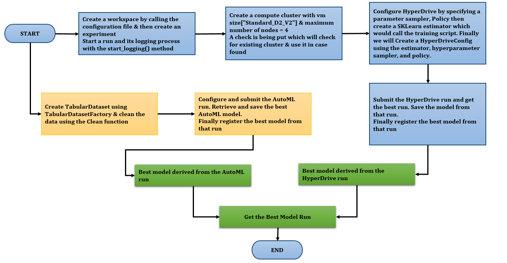
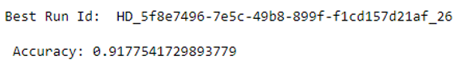
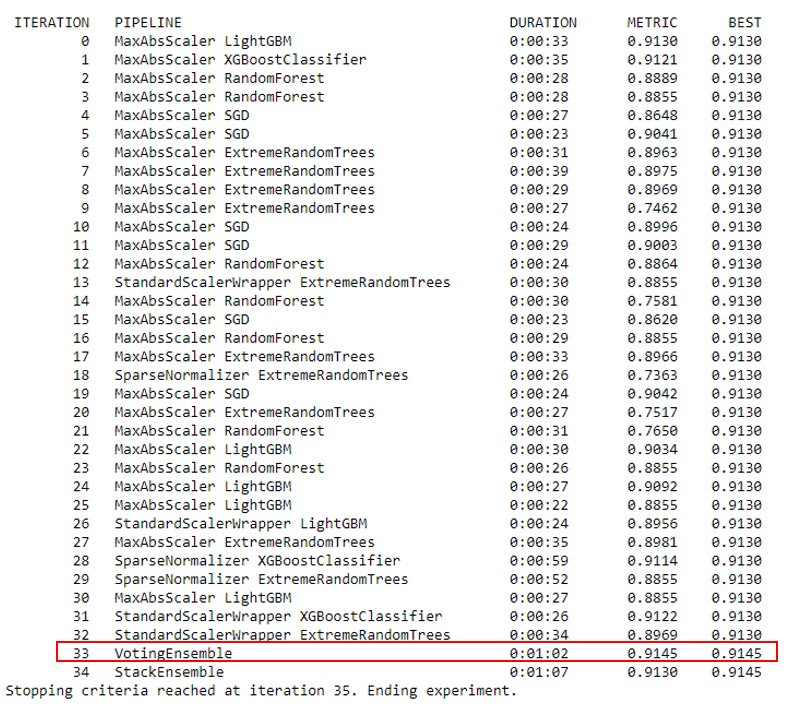
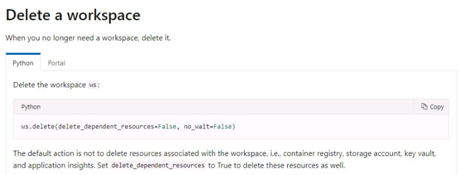

# Optimizing an ML Pipeline in Azure

## **HyperDrive vs. Automated Machine Learning**

### **Classification using Bank Marketing Dataset**

### **Overview**

In this project, we will have the opportunity to create and optimize an
ML pipeline. We are being, provided a custom-coded model---a standard
Scikit-learn Logistic Regression---the hyperparameters of which we will
optimize using HyperDrive. We will also use AutoML to build and optimize
a model on the same dataset, so that we can compare the results of the
two methods.

### **Summary**

In this project, we are using the Bank Marketing dataset to display how
we can use HyperDrive and AutoML for a classification problem and save
the best model. The classification goal is to predict if the client will
subscribe to a term deposit with the bank.

The best performing model is through **HyperDrive run** since its
**Accuracy is 0.9177541729893779** and the Accuracy for the best run
through **AutoML is 0.9145** through **VotingEnsemble** algorithm.

### **Scikit-learn Pipeline**

#### **Pipeline Architecture** 

1.  Create a workspace and an experiment

2.  Create a Compute Cluster

3.  Configure HyperDrive by specifying a parameter sampler, Policy then
    create a SKLearn estimator, which would call the training script.
    Finally, we will create a HyperDriveConfig using the estimator,
    hyperparameter sampler, and policy.

4.  Submit the HyperDrive run and get the best run. Finally save the
    model from that run.

5.  Register the model from that run

6.  Create TabularDataset using TabularDatasetFactory & clean the data
    using the Clean function

7.  Configure and submit the AutoML run

8.  Retrieve and save the best AutoML model

9.  Register the model from that run

10. Finally get the best model through comparison

**Refer to below Figure for End-to-End architecture diagram**

#### **Data**

In this project, we are using the Bank Marketing dataset. The
classification goal is to predict if the client will subscribe to a term
deposit with the bank.

#### ***HyperDrive Run***

In the HyperDrive run, we define the below factors before creating the
HyperDrive configuration:

1.  **Parameter Sampler --** We are using RandomParameterSampling Class
    with a parameter_space which is a dictionary containing each
    parameter and its distribution. The dictionary key is the name of
    the parameter. We are using Inverse of regularization strength and
    Maximum Iterations as two parameters.

a)  **Inverse of regularization strength -** One of the major aspects of
    ML is to avoid overfitting. We use regularization to avoid
    overfitting so that we get more, accurate predictions.
    Regularization is, used to apply a penalty to increase the magnitude
    of parameter values in order to reduce overfitting. When we train a
    ML model, e.g., a logistic regression model, there we choose
    parameters that gives us the best fit to the data. This means
    minimizing the error between the predicted value and the actual
    values. If we have many parameters, but less amount of data, then
    the model might get adapt to all the parameters perfectly, which
    will cause overfitting. **Inverse of regularization strength must,
    be a positive float. Smaller values specify stronger
    regularization.**

b)  **Maximum Iterations to converge --** We should not use the results
    from a logistic regression unless the parameter estimates have
    converged. We can increase the number of iterations allowed to see
    if they will converge**.**

> **Note:** *We can choose to sample from a set of discrete values or a
> distribution of continuous values. In this case, we could use the
> choice function to generate a discrete set of values and uniform
> function to generate a distribution of continuous values.*

2.  **Policy - Defines an early termination policy based on slack
    criteria, and a frequency and delay interval for evaluation.**

a)  **slack_factor \[float\] -** The ratio used to calculate the allowed
    distance from the best performing experiment run.

b)  **evaluation_interval \[Integer\] -** The frequency for applying the
    policy.

> **Note:** We could also use additional parameters like **slack_amount
> \[***The absolute distance allowed from the best performing run***\]
> and delay_evaluation \[***The number of intervals for which to delay
> the first policy evaluation. If specified, the policy applies every
> multiple of evaluation_interval that is greater than or equal to
> delay_evaluation.***\].** *Although these are optional parameters.*
>
> **Benefits -** *Consider a Bandit policy with slack_factor = 0.2 and
> evaluation_interval = 100. Assume that run X is the currently best
> performing run with an Accuracy (performance metric) of 0.8 after 100
> intervals. Further, assume the best AUC reported for a run is Y. This
> policy compares the value (Y + Y \* 0.2) to 0.8, and if smaller,
> cancels the run. If delay_evaluation = 200, then the first time the
> policy will be applied is at interval 200.*

3.  **Estimator -** Then we would create an estimator which would use
    the train.py script from the defined location using the compute
    cluster

4.  **HyperDrive Configuration -** Finally, we create a HyperDriveConfig
    using the estimator, hyperparameter sampler, and policy. Also the
    primary metric used for evaluation purpose is "**Accuracy**" and the
    objective is to **Maximize** it.

### **AutoML**

-   There are several options that, we could use to configure our
    automated machine learning experiment. These parameters are, set by
    instantiating an AutoMLConfig object.

-   We are using Classification experiment using Accuracy as the primary
    metric with experiment timeout minutes set to 30 minutes and 5
    cross-validation folds.

-   Automated machine learning tries different models and algorithms
    during the automation and tuning process. As a user, there is no
    need for us to specify the algorithm. **\[We can use
    the allowed_models or blocked_models parameters to further, modify
    iterations with the available models to include or exclude.\]**

-   The primary metric parameter determines the metric to be, used
    during model training for optimization. The available metrics, we
    can select is determined by the task type we choose. In our case the
    Task type is Classification hence we would be using "Accuracy" as
    primary metric.

-   In every automated machine learning experiment, data is
    automatically scaled, and normalized to help certain algorithms that
    are sensitive to features that are on different scales. This scaling
    and normalization is, referred to as featurization. **In our case,
    featurization has been set to auto, which indicates that as part of
    pre-processing, data guardrails and featurization steps are,
    performed automatically. Default setting.**

-   There are a few options we can define in our AutoMLConfig to end our
    experiment. **Use experiment_timeout_minutes in our settings to
    define how long, in minutes, your experiment should continue to
    run.**

### **Pipeline Comparison**

The best performing model is through **HyperDrive run** since its
**Accuracy is 0.9180576631259484** and the Accuracy for the best run
through **AutoML is 0.9178** through **VotingEnsemble** algorithm.

**HyperDrive Best Run Details:**

**AutoML Best Run Details:**

### **Future work**

As part of future work, we can improvise on the below factors:

-   Use other hyperparameters which are available for Scikit-learn
    Logistic Regression

-   Instead of Random parameter sampling, we could use Grid sampling
    which would exhaustively search over the search space. Supports
    early termination of low-performance runs. Performs a simple grid
    search over all possible values. Grid sampling can, only be used
    with choice hyperparameters.

-   For early termination policy we use Bandit policy, however we could
    also use additional parameters like **slack_amount \[**The absolute
    distance allowed from the best performing run**\] and
    delay_evaluation \[**The number of intervals for which to delay the
    first policy evaluation. If specified, the policy applies every
    multiple of evaluation_interval that is greater than or equal to
    delay_evaluation.**\].** Although these are optional parameters.

### **Proof of cluster clean up**

